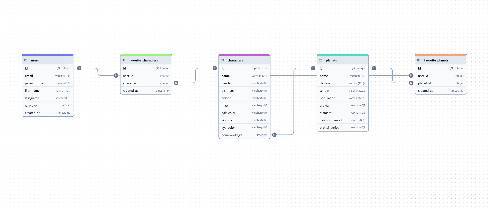

# 📝 Modelo de Datos del Blog

Este proyecto implementa el modelo de datos y estructura base para un blog usando **Flask**, **SQLAlchemy** y **Alembic** para la gestión de migraciones.

---

## 🚀 Tecnologías usadas
- **Python 3**
- **Flask** — Framework web
- **Flask SQLAlchemy** — ORM
- **Flask Migrate / Alembic** — Migraciones
- **DrawDB** — Creación del diagrama ERD

---

## 📊 Diagrama de Entidad-Relación (ERD)



**Tablas principales:**
- **user** — autores registrados
- **post** — publicaciones de usuarios
- **comment** — comentarios a publicaciones
- **category** — categorías con relación M:N a post
- **like** — likes únicos por usuario y post

---

## ⚙️ Instalación

```bash
# 1. Clonar repositorio
git clone https://github.com/alejandrabarcena/modelo-de-datos-blog.git
cd modelo-de-datos-blog

# 2. Crear entorno virtual
pipenv install

# 3. Activar entorno
pipenv shell

# 4. Configurar variables de entorno
cp src/.env.example .env

# 5. Inicializar base de datos
flask db upgrade

# 6. Ejecutar el servidor
flask run

📂 Estructura de carpetas
modelo-de-datos-blog/
│── migrations/         # Migraciones Alembic
│── src/                # Código fuente
│   ├── app.py           # App Flask
│   ├── models.py        # Modelos SQLAlchemy
│   ├── .env.example     # Variables de entorno
│── diagram.png          # Diagrama ERD
│── README.md

